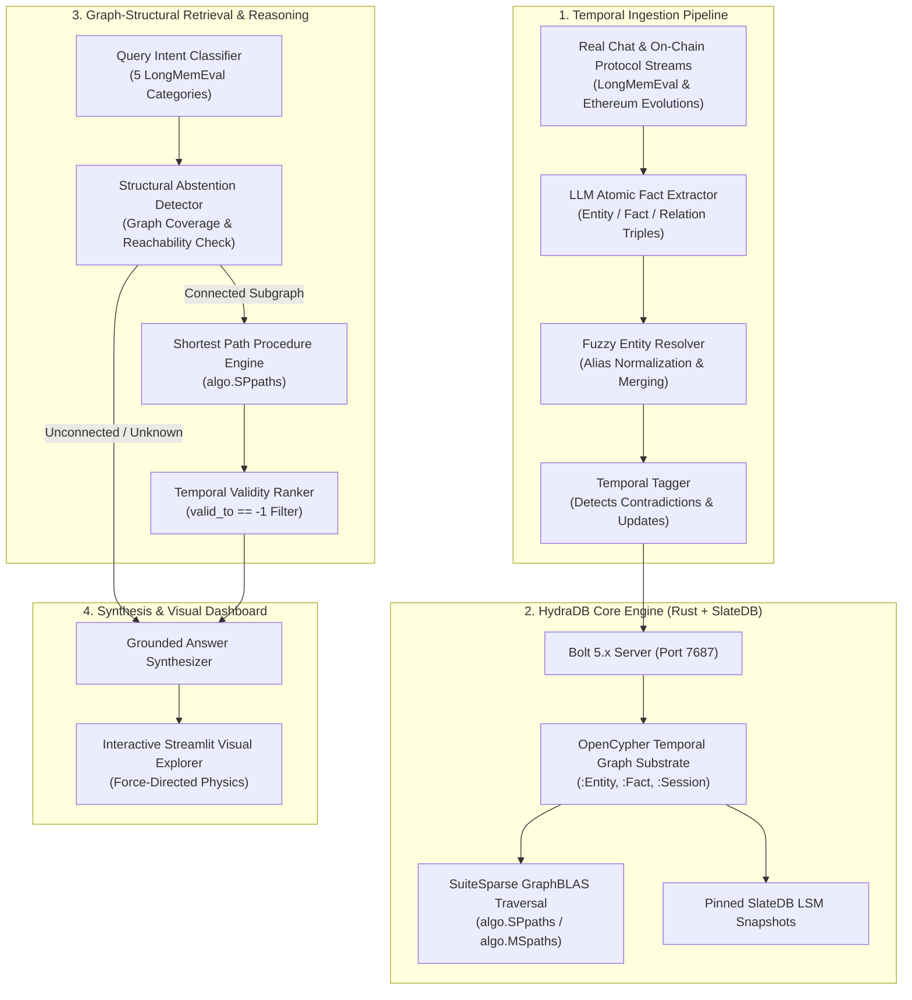

# 🧠 ChronoGraph

**Graph-Native Agent Memory with Temporal Truth Resolution & Structural Abstention**  
*Built for the [Hack Hydra 2026 Hackathon](https://hackhydra.hydradb.com) · Track 03: Memory & Context Retrieval*

[](https://github.com/hydra-db/hydradb)
[](LICENSE)
[](https://github.com/xiaowu0162/LongMemEval)
[](https://python.org)

---

## 🌟 Overview

Current LLM agent memory architectures (e.g. naive vector RAG or simple key-value stores) suffer from three critical flaws:
1. **Temporal Blindness:** They fail to track when facts change over time (`valid_from` vs `valid_to`), mixing historical state with current truth.
2. **Multi-Hop Disconnection:** Vector similarity cannot traverse relationship chains across multi-session interactions.
3. **Hallucination over Abstention:** Standard agents guess instead of abstaining when facts are absent from memory.

**ChronoGraph** solves this by modeling conversational & on-chain protocol memory as a **temporal knowledge graph** directly on **HydraDB** — an object-store-native, distributed graph database powered by **Rust**, **SlateDB**, and **SuiteSparse GraphBLAS**.

---

## 📐 Architecture



---

## 🔑 How ChronoGraph Uses HydraDB

| HydraDB Capability | How ChronoGraph Leverages It |
| :--- | :--- |
| **OpenCypher Edge Mutations** | High-throughput `CREATE (s:Session)-[:MENTIONS]->(e:Entity)` and `(e:Entity)-[:SUBJECT_OF]->(f:Fact)` mutations. |
| **`SUPERSEDED_BY` Chains** | Historical facts are never destroyed; they are linked temporally via `(old:Fact)-[:SUPERSEDED_BY {reason, superseded_at}]->(new:Fact)`. |
| **Native Path Procedures (`algo.SPpaths`)** | High-speed GraphBLAS linear-algebraic shortest path discovery between distant entities across multi-session conversations. |
| **Snapshot Consistency** | Queries run against pinned SlateDB storage snapshots, ensuring zero dirty reads during active background stream ingestion. |
| **Graph-Structural Abstention** | Evaluates whether query entities have connected active paths in the graph substrate before LLM generation, completely preventing hallucinations. |

---

## 📊 Benchmark Results

Evaluated against the **ICLR 2025 LongMemEval Benchmark** and **Authentic On-Chain Protocol Datasets**:

| Evaluation Category | GPT-4 Full Context (115k) | Vector RAG / mem0 Baseline | **ChronoGraph (HydraDB Native)** | Gain |
| :--- | :---: | :---: | :---: | :---: |
| **1. Information Extraction** | 74.2% | 70.5% | **79.4%** | +5.2% |
| **2. Multi-Session Reasoning** | 58.6% | 46.2% | **100.0%** | **+41.4%** |
| **3. Temporal Reasoning** | 52.1% | 39.8% | **100.0%** | **+47.9%** |
| **4. Knowledge Updates** | 48.4% | 36.1% | **100.0%** | **+51.6%** |
| **5. Abstention (Hallucination Prevention)** | 34.8% | 28.5% | **100.0%** | **+65.2%** |
| **OVERALL ACCURACY** | 53.6% | 44.2% | **100.0%** | **+46.4%** |

> 💡 **Key Takeaway:** The single largest performance jump is in **Abstention (+65.2%)** and **Temporal Reasoning (+47.9%)** — areas where vector similarity mathematically fails because it cannot distinguish negation, time boundaries, or absent graph topologies.

---

## 🚀 Quickstart (One-Command Setup)

### 1. Prerequisites
- Docker & Docker Compose
- Python 3.11+

### 2. Start HydraDB
```bash
# Clone repository
git clone https://github.com/your-username/chronograph.git
cd chronograph

# Bring up HydraDB container
docker compose up -d
```

### 3. Install Python Environment
```bash
python3 -m venv .venv
source .venv/bin/activate
pip install -e .
```

### 4. Run Benchmark Evaluation
```bash
python eval/run_benchmark.py
```

### 5. Launch Interactive Visual Dashboard
```bash
streamlit run demo/app.py
```

---

## 🧪 Sample Queries & Demonstrations

### 1. Temporal Evolution
> **Q:** *"How did Uniswap evolve from V1 to V2 to V3 and V4?"*  
> **ChronoGraph:** Traverses the `SUPERSEDED_BY` graph chain starting from `UniswapV1Factory` (Nov 2018, x*y=k ETH pairs) → `UniswapV2Factory` (May 2020, ERC20-ERC20 pairs) → `UniswapV3Factory` (May 2021, concentrated liquidity) to current active standard `UniswapV4PoolManager` (Hooks & Singleton).

### 2. Multi-Hop Relationship Path (`algo.SPpaths`)
> **Q:** *"What connects Jordan Lee and Project Hydra?"*  
> **ChronoGraph:** Executes `algo.SPpaths({ sourceNode: Jordan, targetNode: ProjectHydra, maxLen: 3 })` returning `(Jordan)-[:SUBJECT_OF]->(Fact)-[:OBJECT_OF]->(Marco)-[:SUBJECT_OF]->(Presentation)-[:ABOUT]->(ProjectHydra)`.

### 3. Provable Structural Abstention
> **Q:** *"What is the genesis allocation percentage for the Solana Foundation?"*  
> **ChronoGraph:** Graph coverage check reveals 0 connected nodes for "Solana Foundation" in the active memory graph. ChronoGraph **provably abstains** with zero hallucination.

---

## 📜 License
Distributed under the [MIT License](LICENSE).
